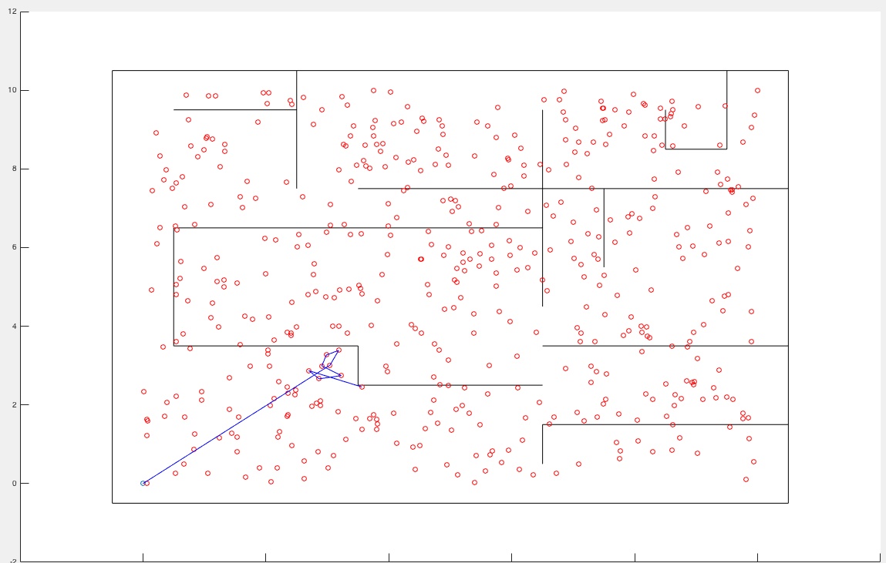

This a path planner for the Matlab iRobot Create Simulator.

You can download the simulator from here: https://sourceforge.net/projects/createsim/

The exact problem statement is given here: http://www.cse.iitd.ac.in/~subodh/courses/SIV889/exercise.pdf

To download additional obstacle files: http://www.cse.iitd.ac.in/~subodh/courses/SIV889/maps/

This package makes use of the A* Graph Search Algorithm for finding a collision free path in a world consisting of static obstacles. This package has been developed only for a world with static obstacles but can be easily extended for Dynamic Obstacles as well.

To run this package:

First open the create sim in Matlab. You should also have the obstacle file you want to use in the same directory as the path_planner.m file. The obstacle contains coordinated of static obstacle corners in the world. You can specify the file that you want to use in the path_planner.m code.

Now, load the path_planner.m file. The goal coordinates by default are (10, 10) but can be changed if required.
Please note the start_point is (0,0) and goal is (10, 10).

path_planner.m computes a collision free path from (0,0) to (10, 10). It first generates random points in the planning space and then uses A* graph search to find a collision free path.

Upon running the path_planner.m a figure would appear that will have those randomly generated points as shown in the image below. For visualisation purpose, I have made a tool by which the graph search as it happens can be visualised. It can be clearly in the video here: https://www.youtube.com/watch?v=YtHDf4tnGBbI

After the graph search is over the calculated path is given to the robot for execution.